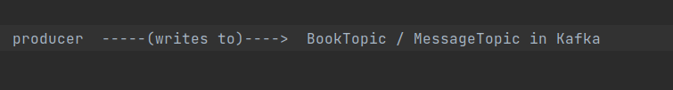
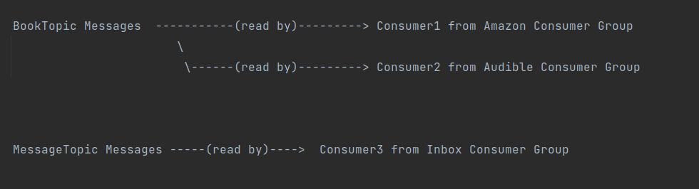
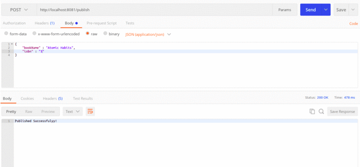

# Apache Kafka producer and consumer with spring boot

The repository helps newbies to get started developing with kafka using spring-kafka library and spring boot.
The code can be used as a seed to experiment / play around with kafka.


### Next Step

Use docker compose to simplify setting up


### Setup and Running

   1.   Downloaded scala-2.12 binary from:
          https://kafka.apache.org/downloads and extract it
 

   2. Start zookeeper and kafka 
   
   ```
       #  zookeper is a dependency for kafka
       #  so run this first
       
   /path/to/kafka$$ bin/zookeeper-server-start.sh config/zookeeper.properties 
 
 
      # start kafka server:
     
   /path/to/kafka$$ bin/kafka-server-start.sh config/server.properties 

   ```

   3. Either import the producer and consumer project into IDE and run them. You can also 
      use maven to package the producer and consumer project and then run the jars


   4. Import the postman collection using which you can make REST API call to producer
      to publish message to kafka which is ready by consumer


## Code Contents

The <em>apache-kafka-producer-demo</em> project supports two endpoints -`/publish` and `/publish/{path-param}`
The `/publish` endpoint is used to publish book objects with json request payload and `/publish/{path-param}` is used
to publish text messages as json payload
 
           


There are <b>3 consumers</b> in <em>apache-kafka-consumer-demo</em> project that read messages 
published to BookTopic and MessageTopic:




### Screenshot of Output




### References

1. [Kafka Producer | Daily Code Buffer](https://www.youtube.com/watch?v=wBGT7u_R-tw&t=464s)

2. [Kafka Consumer | Daily Code Buffer ](https://www.youtube.com/watch?v=80ngRl7RhCw&t=546s)

3. [Kafka Consumer | Tech Primer ](https://www.youtube.com/watch?v=IncG0_XSSBg)

4. [JsonDeserializer for Consumer | StackOverflow](https://stackoverflow.com/questions/54690518/spring-kafka-jsondesirialization-messageconversionexception-failed-to-resolve-cl)

5. [Intro Apache Kafka with Spring | Baeldung](https://www.baeldung.com/spring-kafka)